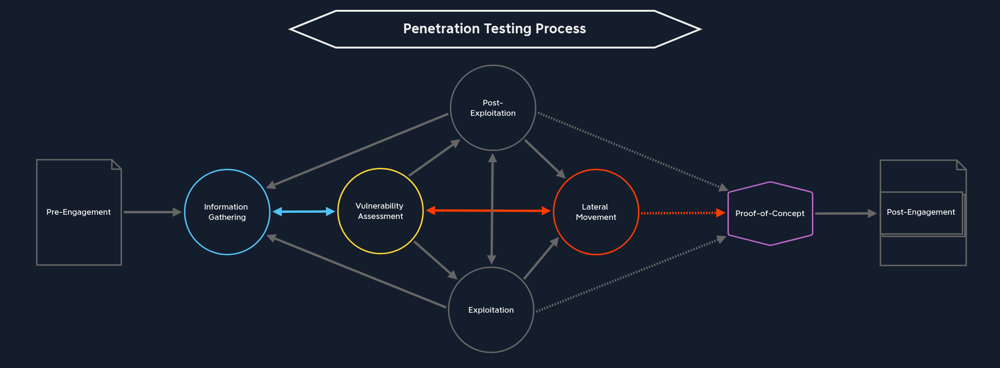

# Lateral Movement (橫向移動)

如果一切順利，我們成功滲透到企業網路（Exploitation），收集了本地儲存的信息，並提升了權限（Post-Exploitation），接下來我們將進入下一Lateral Movement階段。這一階段的目標是測試攻擊者在整個網路中可能採取的行動。畢竟，主要目標不僅是成功利用公開可用的系統，還要獲取敏感數據，或找出攻擊者可以癱瘓網路的所有方法。勒索軟體就是最常見的例子之一。如果企業網路中的某個系統感染了勒索軟體，它就可以在整個網路中傳播。勒索軟體會使用各種加密方法鎖定所有系統，使整個公司都無法使用這些系統，直到輸入解密金鑰為止。

在最常見的情況下，公司會遭到經濟勒索以牟利。通常，只有到了這個時候，公司才會意識到資訊安全的重要性。如果他們之前聘請了優秀的滲透測試人員進行測試（並部署了適當的流程和多層防禦措施），他們或許就能避免這種情況以及由此造成的經濟（甚至法律）損失。人們常常忘記，在許多國家，CEOs are held liable未能妥善保護客戶資料是違法行為。

在這個階段，我們希望測試在整個網路中手動操作的範圍，以及從內部角度可以發現哪些可能被利用的漏洞。為此，我們將再次經歷以下階段：

1. 轉向 (Pivoting)
2. 規避測試 (Evasion Testing)
3. 資訊收集 (Information Collection)
4. 脆弱性評估 (Vulnerability Assessment)
5. （特權）利用 (Privilege Escalation)
6. 後剝削 (Post-Exploitation)
如上圖所示，我們可以從目標系統階段進入此階段Exploitation。Post-Exploitation有時我們可能無法直接提升目標系統本身的權限，但我們可以透過網路進行操作。這就是權限提升機制發揮Lateral Movement作用的地方。

## 轉向 (Pivoting)
大多數情況下，我們使用的系統不具備高效率枚舉內部網路的工具。一些技術允許我們將被攻擊的主機用作代理，並從我們的攻擊機或虛擬機執行所有掃描。這樣，被攻擊的系統就能代表並路由我們從攻擊機發送到內部網路及其網路元件的所有網路請求。

這樣，我們就能確保那些無法路由的網路（因此也無法公開存取）仍然可以被存取。這使我們能夠掃描這些網路的漏洞，並深入滲透到網路內部。這個過程也稱為Pivoting或Tunneling。

一個簡單的例子是，我們家裡有一台無法透過網路存取的印表機，但我們可以從家庭網路發送列印作業。如果家庭網路中的某個主機被入侵，攻擊者就可以利用該主機向這台印表機傳送列印作業。雖然這是一個簡單（且不太可能發生）的例子，但它說明了網路攻擊的目標pivoting，​​即透過中間系統存取無法直接存取的系統。

## 規避測試 (Evasion Testing)
此外，在此階段，我們也應考慮規避性測試是否屬於評估範圍。針對每種策略都有不同的程序，這有助於我們偽裝這些請求，避免引起管理員和藍隊的內部警覺。

有很多方法可以防止橫向移動，包括網路（微）防禦segmentation、threat monitoring/ IPS、IDS/EDR等。為了有效地繞過這些防禦，我們需要了解它們的工作原理以及它們對哪些情況做出反應。然後，我們可以調整並應用有助於避免被偵測到的方法和策略。

## 資訊收集 (Information Collection)
在攻擊內部網路之前，我們必須先了解overview我們的系統可以存取哪些系統以及存取多少系統。這些資訊可能已經可以從上一個後滲透階段獲得，當時我們仔細查看了系統的設定和配置。

我們回到資訊收集階段，但這次，我們將從網路內部以不同的視角進行操作。一旦我們發現了所有主機和伺服器，我們就可以逐一舉它們。

## 脆弱性評估 (Vulnerability Assessment)
從網路內部進行漏洞評估與以往的流程有所不同。這是因為網路內部發生的錯誤遠比暴露在網際網路上的主機和伺服器上的錯誤多得多。在此過程中，groups被分配到的任務以及rights對不同系統組件的職責至關重要。此外，使用者之間共享資訊和文件並協同工作的情況也很常見。

這類資訊對我們策劃攻擊尤其重要。例如，如果我們攻破了某個開發者群組的使用者帳戶，就可能獲得公司開發者所使用的大部分資源的存取權。這很可能為我們提供關於系統的關鍵內部信息，並有助於我們識別漏洞或進一步擴大存取權限。

## （特權）利用 (Privilege Escalation)
一旦找到並確定了這些路徑的優先級，我們就可以進入利用這些路徑存取其他系統的步驟。我們通常會找到破解密碼和雜湊值的方法，從而獲得更高的權限。另一種常用方法是使用我們在其他系統上已有的憑證。有時，我們甚至無需破解哈希值，可以直接使用它們。例如，我們可以使用Responder工具攔截 NTLMv2 雜湊。如果我們能夠攔截到管理員的雜湊值，那麼我們就可以利用這項pass-the-hash技術以該管理員身分（在大多數情況下）登入多個主機和伺服器。

畢竟，Lateral Movement舞台的目的是在內部網路中移動。現有的數據和資訊用途廣泛，通常可以用於多種用途。

## 後剝削 (Post-Exploitation)
一旦我們攻占了一個或多個主機或伺服器，我們將對每個系統再次執行後滲透階段的步驟。在此階段，我們將再次收集系統資訊、已建立使用者的資料以及可作為證據的業務資訊。然而，我們必須再次考慮如何處理這些不同的信息，以及合約中關於敏感資料的規定。

最後，我們準備好進入Proof-of-Concept展示我們辛勤工作成果的階段，並幫助我們的客戶和負責補救工作的人員有效率地複製我們的成果。