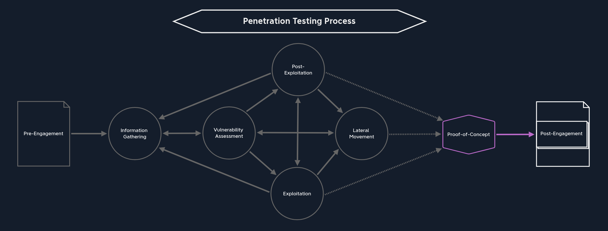

# Proof-of-Concept 概念驗證

Proof of Concept（PoC）或是Proof of Principle專案管理術語。在專案管理中，它用於證明專案在原則上是可行的。其標準可能基於技術或業務因素。因此，它是後續工作的基礎，在本例中，它指的是透過確認已發現的漏洞來採取必要步驟，從而保障企業網路安全。換句話說，它是後續行動決策的依據。同時，它也有助於識別和降低風險。

滲透測試流程：前期準備、資訊收集、漏洞評估、漏洞利用、漏洞利用後、橫向移動、概念驗證、後期評估。

此專案步驟通常整合到新應用軟體（原型開發）或IT安全解決方案的開發流程中。對於資訊安全領域而言，此步驟用於驗證作業系統或應用軟體中的漏洞。我們利用概念驗證 (PoC) 來證明安全問題的存在，以便開發人員或管理員能夠驗證、重現問題、了解其影響並測試修復措施。驗證軟體漏洞最常見的範例之一是在目標系統上執行計算器（Windows 系統中的 calc.exe）。原則上，PoC 也會評估實際利用漏洞成功存取系統的機率。

PoCPoC可以有多種不同的表現形式。例如，documentation發現的漏洞本身也可以構成一個 PoC。更實用的 PoC 版本是能夠自動利用已發現漏洞的腳本script或code測試腳本。這可以演示如何完美地利用這些漏洞。對於管理員或開發人員來說，這種版本非常直觀，因為他們可以看到腳本利用漏洞的特定步驟。

然而，有時會出現一個顯著的缺點。一旦管理員和開發人員收到我們提供的腳本，他們很容易「抵制」我們的腳本。他們會專注於修改系統，使腳本失效。關鍵在於，該腳本只是one way利用特定的漏洞。因此，他們抵制我們的腳本，而不是利用它，並透過修改和加固系統使其失效，並不意味著無法透過其他方式獲取腳本中獲取的資訊。這是一個需要與管理員和開發人員討論並明確指出的重要方面。

他們收到的報告應該幫助他們了解全局，關注更廣泛的問題，並提供清晰的補救建議。在內部評估中，如果網域名稱遭到入侵，加入攻擊鏈演練是一個很好的方法，可以展示多個漏洞是如何組合在一起的，以及修復一個漏洞會如何切斷攻擊鏈，但其他漏洞仍然存在。如果這些漏洞沒有修復，攻擊者可能會透過其他途徑達到攻擊鏈被修復的狀態，並繼續攻擊下去。我們也應該在報告審查會議上強調這一點。

例如，如果使用者使用密碼“” Password123，那麼根本的漏洞不在於密碼本身，而在於password policy網域管理員。如果發現網域管理員正在使用該密碼，並且更改了密碼，那麼該帳戶的密碼強度就會提高，但弱密碼問題很可能仍然會在組織內部普遍存在。

如果密碼策略遵循高標準，使用者就無法使用如此弱的密碼。管理員和開發人員對其係統和應用程式的功能和品質負責。此外，高品質意味著高標準，這一點我們應該在補救建議中加以強調。